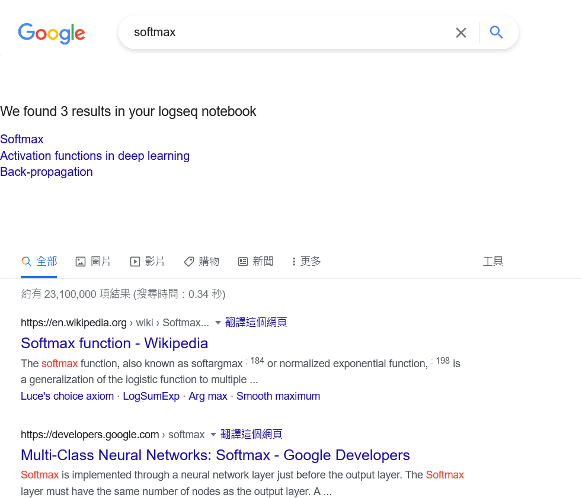

This project is in **VERY EARLY** DEVELOPMENT! I'm just too happy to share my first milestone with you, while it's far away from the _first release_.

Hello, I'm trying to develop a plugin for logseq - [fireSeqSearch](https://github.com/Endle/fireSeqSearch). It is inspired by [Evernote](https://evernote.com)'s browser extension - if we search something, for example, `softmax`, the extension will also do this search against the personal notebook.

This is what [fireSeqSearch](https://github.com/Endle/fireSeqSearch) does on my logseq notebook. It has two parts:

1. search server, which will host all logseq pages on http://127.0.0.1:3030
2. Browser extension, which will attach hits in logseg, and append it to the web page.

This screenshot is an example

